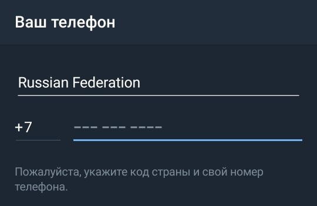
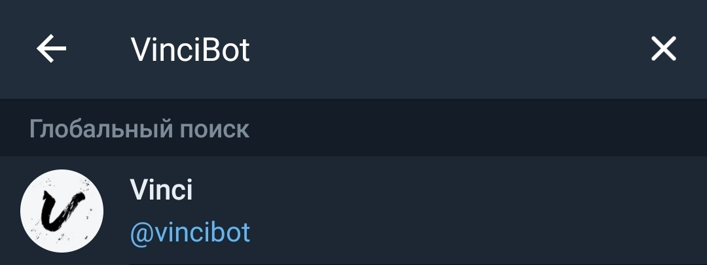

Начало работы
=============
Вход в telegram
---------------------------------------------
Для того, чтобы войти в telegram, вам нужно перейти на сайт или через приложение "https://telegramm-online.ru/#/login" 

Пример входа указан на Рисунке 1.

		Рисунок 1 - вход в telegram

После того, как вы вошли или зарегестрировались в telegram, вам нужно выбрать поиск , как показано на Рисунке 2.

		Рисунок 2 - Выбор категории каналов

Далее вам нужно вписать в стоке поиска название бота, и добавить в начале собачку "@VinciBot", как показано на Рисунке 3.

		Рисунок 3 - Поиск бота

После этого, вам остаётся лишь нажать на бота, и у вас откроется диалог. Поздравляю, вы можете использовать фоторедактор бота! Для прехода к инструкции по использованию, нажмите `здесь`_

.. _здесь: ispolzovanie.html

